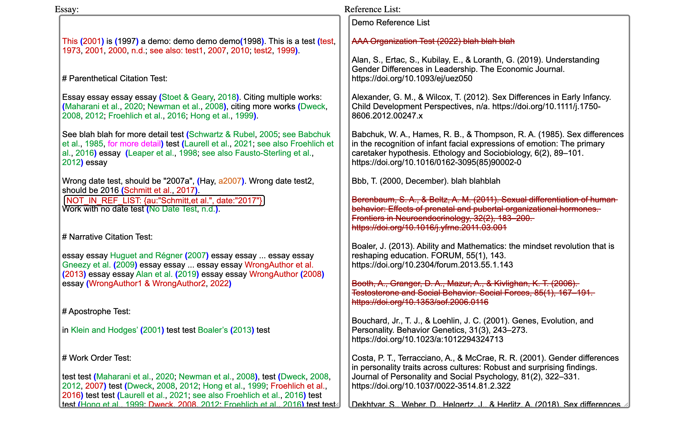

### [Online APA7 In-Text Citation Checker](https://github.com/AdenChen27/APA7-in-text-citation-checker)

There are loads of free online tools to generate a reference list (e.g. [Scribbr](https://www.scribbr.com/citation/generator/apa/)), but what about your in-text citations? Well, try [this](https://adenchen27.github.io/citation_checker/main.html). ([*Github*](https://github.com/AdenChen27/APA7-in-text-citation-checker))

